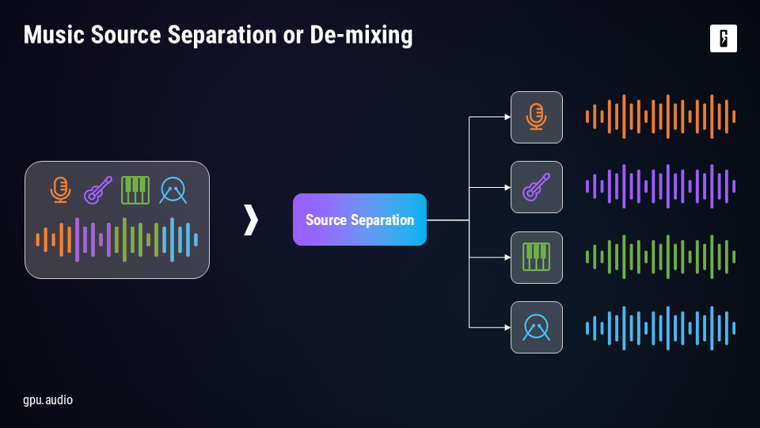
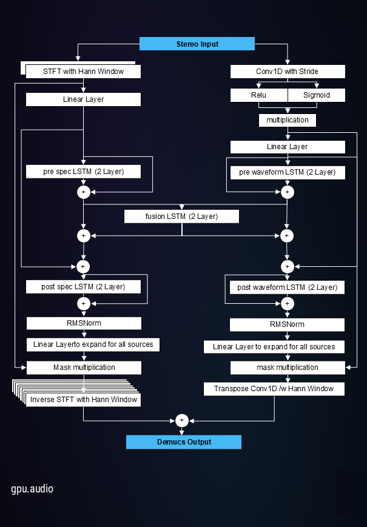
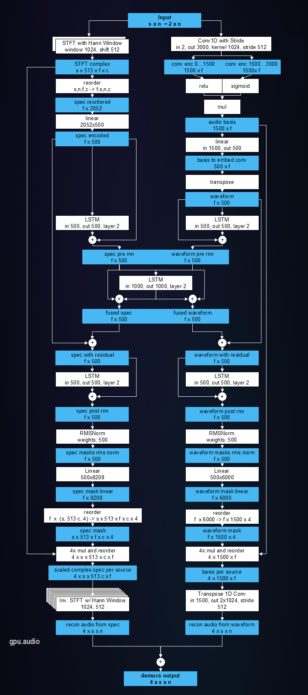

# Real-Time Sound-Source-Separation (RT3S) Processor
This is a parallelizatin of HS-TasNet by Venkatesh et al. [1], based on the publicly available implementation by Phil Wang [2].

## Overview
We start with a stereo recording, which contains all instruments and vocals mixed together, and we want to separate those sources again.
We only have one waveform that’s a sum of all instruments, each overlapping in time and frequency.
Different instruments occupy similar frequency bands, vocals may overlap with guitars or keyboards, and everything is blended into a single mix. Our goal is to undo that mixing process and recover the individual sources as illustrated in the figure below.

We are focusing on HS TasNet for real-time source separation, using the implementation by Phil Wang [2](public on GitHub, MIT license).
### Motivation.
HS-TasNet is currently the best low-latency real-time separation algorithm.
The original implementation is not publicly available, so we rely on Phil Wang's version, which we trained on the MusDB [3] dataset and ported to GPU Audio.
A general overview of the approach can be seen in the figure below.

#### Input & Initial Processing
The input to the network is a mixture waveform.
For the frequency branch we compute a short-term Fourier transform (STFT) with windowing.
The complex output of the STFT is fed into a linear layer.
In the time branch, a 1D convolution is performed, followed byactivation functions and also a subsequent linear layer.
#### LSTM Blocks
Each branch then contains a two-layer LSTM block in a ResNet-style configuration:
The input signal is added back to the output, to preserve information of the input.
The LSTM focuses on masking and identifying which features to pass on or suppress.
#### Combined layer
Both branches are then fused in a fusion LSTM, combining time- and frequency-domain information.
#### Skip Connections
The output of the previous linear layer in both branches is added back to the result of the fused LSTM to ensure full information is retained to aid the mask estimation.
#### Mask Estimation & Separation
Afterwards, time and frequency branch each contain another LSTM layer maintains memory for final separation.
A subsequent RMS normalization in wach branch stabilizes training and improves performance on smaller datasets.
A linear layer in time and frequency branches expands the input features to match all sources, i.e., it computes a mask fer each source.
These masks are then applied to (1) the cpmplex out put of the initial STFT in the frequency branch (2) the combined output of the activation functions in the time branch.
After the mask was applied, we have one feature vector for each of the four sources in each of the two branches.
#### Output Reconstruction
In the frequency branch we apply a inverse STFT with appropriate window normalization to each source's feature vector to get a time domain signal for each source.
In the time domain, we apply a transpose 1D convolution to transform the features of each source back into a time domain waveform.
Both signals (from the frequency branch and the time branch) for each source are simply summed up to produce four stereo output streams: vocals, drums, bass, and other.
#### Complex STFT Option
Lucid Rains can propagate real and imaginary STFT values, rather than just magnitude.
This preserves phase information for potentially slightly better separation quality.
#### Summary
The implementation mirrors the original HS TasNet architecture.
Using GPU Audio neural processing building blocks enables real-time GPU processing.

## Implementation Details
The goal is to work on a single-frame (a specific number of samples) at a time to enable real-time, low-latency inference.
A detailed diagramm of the processor architecture, including input, output and weight dimensions can be found in the figure below.

#### Single-Frame Approach
We eliminate all multiple-frame operations and just process one window at a time.
The input consists 512 new samples and we combine it with the previous 512 samples to form a 1024-sample input buffer.
This simplifies the FFT computation as only two FFTs, i.e., one per input channel, is required.
This yields 252 features per frame and input channel.
There is no need for reordering, as the features are directly written in the correct order.

#### Linear Layers
As we act on a single frame, each linear layer is now single matrix-vector multiplication.
The linear layer in the spectrogram branch conmpacts the 2052 inputs to 500 features.
In the waveform branch, the input to the linear layer compacts the 1500 input to 500 features as well.
As we only hav a vector, due to the single frame processing, no transpositions is required, which reduces memory movement and allows for faster processing.

#### LSTM Layers
As each LSTM now processes only one frame vector, the computations are much more efficient.
The same concept applies to the fusion LSTM and branch LSTMs: one vector in, one vector out.

#### RMS Normalization & Output Layers
The RMS normalization is applied per vector, which is straightforward.
The multiplication with spectrogram & waveform data is handled directly without extra transforms.

#### Inverse Transform & Overlap Handling
The inverse FFTs are applied directly on the 8 individual buffers (four stereo sources).
The output is then combined via summation.

#### Overlap handling:
For the current output we use the first 512 samples of the current call combined with last 512 samples of previous output.
The remaining 512 samples kept for next frame.
This maintains continuity and correct normalization (e.g., Hann window) for continuous streams.

#### Key Takeaways for Real-Time Streaming:
The single-frame processing simplifies computation and reduces memory operations.
The overlap management of samples of and proper bookkeeping are essential for continuous, low-latency output.
All major operations (FFT, linear layers, LSTMs, RMS, deconvolution) can now be applied vector-wise, achieving efficiency without losing model fidelity.
For more implementation details, please refer to the code comments.

## Folder structure
#### python
The python folder contains the HS-TasNet implementation by Phil Wang [2], which can be used for training.
We modified the implementation such that the trained weights are written to separate files on the disk.
#### pack_weights
Packs the trained weights written by the python training script into a single binary weight file, which can be used by the processor/processor library
#### rt3s_processor
The processor source code.

[1] https://www.l-acoustics.com/wp-content/uploads/2024/04/real_time_demixer_2024_04_19.pdf  
[2] https://github.com/lucidrains/hs-tasnet  
[3] https://sigsep.github.io/datasets/musdb.html
